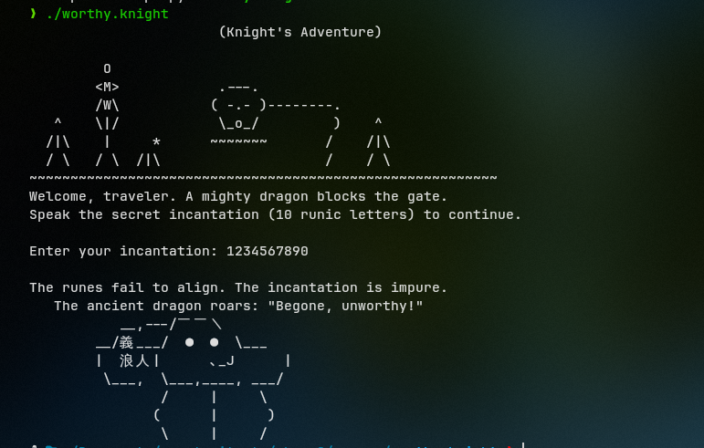
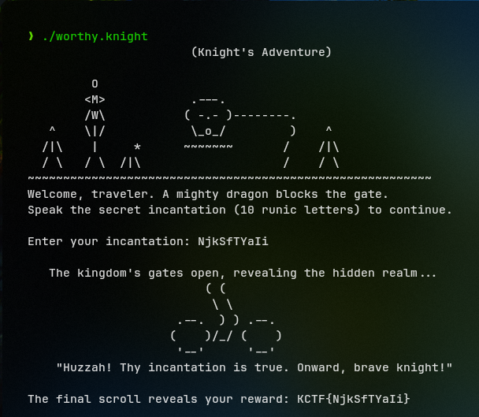
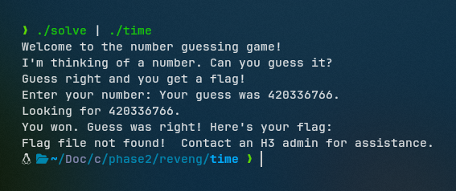
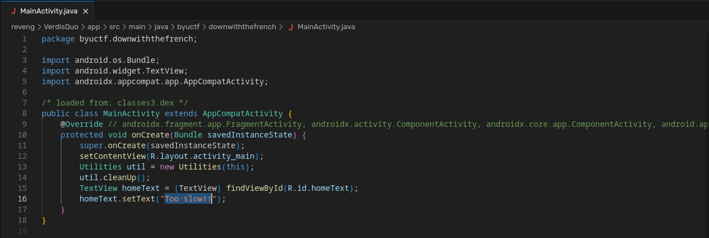
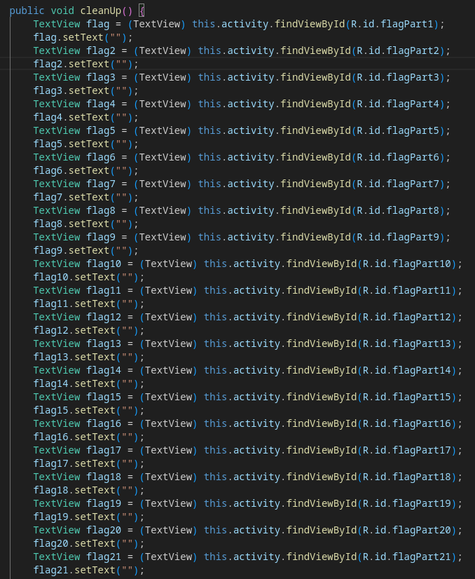
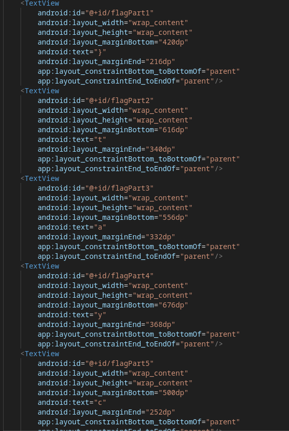
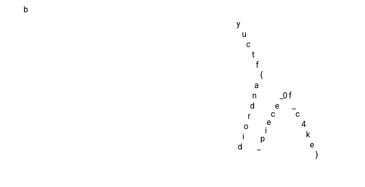

# 1. worthy.knight
## Solution
Executing the binary, we get to know that the "incantation" has to be exactly 10 characters and has to follow some pattern.



Decompiling the binary using _Ghidra_, we see [this function](assets_reveng/wk-fn.c) which is the bulk of the program.

The function runs multiple checks:
1) It takes input into a buffer `local_c8` and checks whether `strlen(local_c8`) == 10, i.e. the input has to be exactly 10 characters
2) It runs a `do...while` loop which iterates through 2 input characters at a time (i.e. it runs pairwise) 
  - Using `__ctype_b_loc`, the program verifies if both characters inputted are *alphabetic*.
    ```
    if (((uVar2 & 0x400) == 0) || (uVar3 = (*ppuVar7)[pbVar8[1]], (uVar3 & 0x400) == 0)) {
    puts("\nThe runes fail to align. The incantation is impure.");
    puts(&DAT_001022b8);
    goto LAB_0010124c;
    }
    ```
  - If both the characters inputted are of the same *case*, the "incantation" is rejected, i.e. both characters need to be of the opposite case.
    ```
    if ((((uVar2 & 0x100) != 0) && ((uVar3 & 0x100) != 0)) ||
      (((uVar2 & 0x200) != 0 && ((uVar3 & 0x200) != 0)))) {
    puts("\nThe ancient seals do not resonate with your runes.");
    puts(&DAT_001022b8);
    goto LAB_0010124c;
    }
    ```
3) For every pair that runs through the `do...while` loop, they have specific checks:
  - for pair 1: char[0] and char[1]
    - char[0] ^ char[1] == 0x24
    - char[1] = 0x6a (j)
    - hence, char[0] = 0x6a ^ 0x24 = 0x4e (N)
  - for pair 2: char[2] and char[3]
    - char[2] ^ char[3] == 0x38
    - char[3] = 0x53 (S)
    - hence, char[2] = 0x38 ^ 0x53 = 0x6b (k)
  - for pair 3: char[4] and char[5]
    - their positions are *swapped*, then the MD5 hash of this pair is calculated and checked against `33a3192ba92b5a4803c9a9ed70ea5a9c`
    - to calculate this pair, I simply made this script:
    ```
    import hashlib

    target = "33a3192ba92b5a4803c9a9ed70ea5a9c"
    
    for c1 in "ABCDEFGHIJKLMNOPQRSTUVWXYZ":
        for c2 in "abcdefghijklmnopqrstuvwxyz":
            if hashlib.md5(bytes([ord(c2), ord(c1)])).hexdigest() == target:
                print(f"Found: {c1}{c2}")
            if hashlib.md5(bytes([ord(c1), ord(c2)])).hexdigest() == target:
                print(f"Found: {c2}{c1}")
    ```
    - this gives us the pair: `fT`
  - for pair 4:  char[6] and char [7]
    - char[6] ^ char[7] == 0x38
    - char[7] = 0x61 (a)
    - hence, char[6] = 0x38 ^ 0x61 = 0x59 )(Y)
  - for pair 5: char[8] and char[9]
     - char[9] ^ char[8] == 0x20 
     - char[9] = 0x69 (i)
     - hence, char[8] = 0x20 ^ 0x69 = 0x49 (I)

Finally, combining the results of the pair wise operations, we get the string to be: `NjkSfTYaIi`, and inputting this to the program we get our flag.



## Flag:
`KCTF{NjkSfTYaIi}`
  
## Notes:
- There was likely a much more efficient way to solve this challenge but I couldn't think of it :p
***
# 2. time
Decompiling the given binary (I used *angr*):

```
int main(unsigned int a0, unsigned long long a1){
    unsigned long long v0;  // [bp-0x28]
    unsigned int v1;  // [bp-0x1c]
    char v2;  // [bp-0x18], Other Possible Types: unsigned int
    unsigned int v3;  // [bp-0x14]

    v1 = a0;
    v0 = a1;
    srand(time(NULL));
    v3 = rand();
    puts("Welcome to the number guessing game!");
    puts("I'm thinking of a number. Can you guess it?");
    puts("Guess right and you get a flag!");
    printf("Enter your number: ");
    fflush(__TMC_END__);
    __isoc99_scanf("%u", &v2);
    printf("Your guess was %u.\n", v2);
    printf("Looking for %u.\n", v3);
    fflush(__TMC_END__);
    if (v3 == v2)
    {
        puts("You won. Guess was right! Here's your flag:");
        giveFlag();
    }
    else
    {
        puts("Sorry. Try again, wrong guess!");
    }
    fflush(__TMC_END__);
    return 0;
}
```

As we can see, the program compares the user's input to the output of `rand()`, and `srand(time(NULL))` sets the key for the pseudo-RNG to be the current Unix timestamp, therefore we can easily script the same function in C and pipe out the "random" number to the binary, getting the flag.

The script:
```
#include <stdio.h>
#include <stdlib.h>
#include <time.h>

void main() {
    srand(time(0)); 
    int guess = rand();
    printf("%d\n", guess);
}
```



## Flag:
N/A
***
# 3. VerdisQuo
On opening the `.apk` file, we only see "Too slow!!"


Upon decompiling the `.apk` with `jadx` and going through the files, we see:



We see that `util.Cleanup()` is called before "Too slow!!" is sent to be rendered, which is present in `Utilities.java`



Now, we can see that `cleanUp()` sets characters of the flag to null so that they are not shown on the screen and looking through the source code, we find the original characters in `app/src/main/res/layout/activity_main.xml`



All of the characters are assigned a `marginBottom` and a `marginEnd` value, presumably to dictate their positions w.r.t two margins on the screen, one on the right and one on the bottom, and thus we cannot just take the characters in order to get the flag.

To get the appropriate positioning between the characters, I translated the `margin` values from the XML to CSS and obtained the flag. 



## Flag:
`byuctf{android_piece_0f_c4ke}`
## Notes:
- attempted to patch the original .apk file and render the text that way but that took too much time
- attempted to view the flag using Android Studio but gave up half way and thought CSS to be easier
***
# 4. JoyDivision
