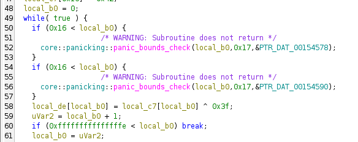
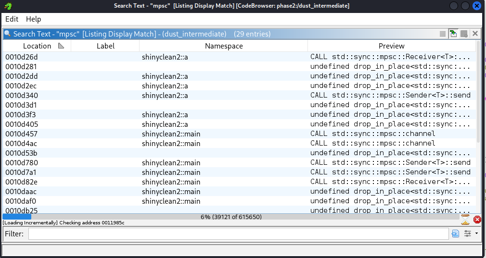
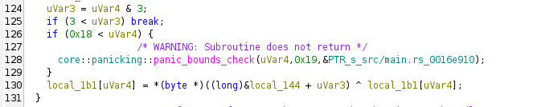

# 1. worthy.knight
## Solution
Executing the binary, we get to know that the "incantation" has to be exactly 10 characters and has to follow some pattern.


Decompiling the binary using _Ghidra_, we see [this function](assets_reveng/wk-fn.c) which is the bulk of the program.

The function runs multiple checks:
1) It takes input into a buffer `local_c8` and checks whether `strlen(local_c8`) == 10, i.e. the input has to be exactly 10 characters
2) It runs a `do...while` loop which iterates through 2 input characters at a time (i.e. it runs pairwise) 
  - Using `__ctype_b_loc`, the program verifies if both characters inputted are *alphabetic*.
    ```
    if (((uVar2 & 0x400) == 0) || (uVar3 = (*ppuVar7)[pbVar8[1]], (uVar3 & 0x400) == 0)) {
    puts("\nThe runes fail to align. The incantation is impure.");
    puts(&DAT_001022b8);
    goto LAB_0010124c;
    }
    ```
  - If both the characters inputted are of the same *case*, the "incantation" is rejected, i.e. both characters need to be of the opposite case.
    ```
    if ((((uVar2 & 0x100) != 0) && ((uVar3 & 0x100) != 0)) ||
      (((uVar2 & 0x200) != 0 && ((uVar3 & 0x200) != 0)))) {
    puts("\nThe ancient seals do not resonate with your runes.");
    puts(&DAT_001022b8);
    goto LAB_0010124c;
    }
    ```
3) For every pair that runs through the `do...while` loop, they have specific checks:
  - for pair 1: char[0] and char[1]
    - char[0] ^ char[1] == 0x24
    - char[1] = 0x6a (j)
    - hence, char[0] = 0x6a ^ 0x24 = 0x4e (N)
  - for pair 2: char[2] and char[3]
    - char[2] ^ char[3] == 0x38
    - char[3] = 0x53 (S)
    - hence, char[2] = 0x38 ^ 0x53 = 0x6b (k)
  - for pair 3: char[4] and char[5]
    - their positions are *swapped*, then the MD5 hash of this pair is calculated and checked against `33a3192ba92b5a4803c9a9ed70ea5a9c`
    - to calculate this pair, I simply made this script:
    ```
    import hashlib

    target = "33a3192ba92b5a4803c9a9ed70ea5a9c"
    
    for c1 in "ABCDEFGHIJKLMNOPQRSTUVWXYZ":
        for c2 in "abcdefghijklmnopqrstuvwxyz":
            if hashlib.md5(bytes([ord(c2), ord(c1)])).hexdigest() == target:
                print(f"Found: {c1}{c2}")
            if hashlib.md5(bytes([ord(c1), ord(c2)])).hexdigest() == target:
                print(f"Found: {c2}{c1}")
    ```
    - this gives us the pair: `fT`
  - for pair 4:  char[6] and char [7]
    - char[6] ^ char[7] == 0x38
    - char[7] = 0x61 (a)
    - hence, char[6] = 0x38 ^ 0x61 = 0x59 )(Y)
  - for pair 5: char[8] and char[9]
     - char[9] ^ char[8] == 0x20 
     - char[9] = 0x69 (i)
     - hence, char[8] = 0x20 ^ 0x69 = 0x49 (I)

Finally, combining the results of the pair wise operations, we get the string to be: `NjkSfTYaIi`, and inputting this to the program we get our flag.


## Flag:
`KCTF{NjkSfTYaIi}`
  
## Notes:
- There was likely a much more efficient way to solve this challenge but I couldn't think of it :p
***
# 2. time
Decompiling the given binary (I used *angr*):

```
int main(unsigned int a0, unsigned long long a1){
    unsigned long long v0;  // [bp-0x28]
    unsigned int v1;  // [bp-0x1c]
    char v2;  // [bp-0x18], Other Possible Types: unsigned int
    unsigned int v3;  // [bp-0x14]

    v1 = a0;
    v0 = a1;
    srand(time(NULL));
    v3 = rand();
    puts("Welcome to the number guessing game!");
    puts("I'm thinking of a number. Can you guess it?");
    puts("Guess right and you get a flag!");
    printf("Enter your number: ");
    fflush(__TMC_END__);
    __isoc99_scanf("%u", &v2);
    printf("Your guess was %u.\n", v2);
    printf("Looking for %u.\n", v3);
    fflush(__TMC_END__);
    if (v3 == v2)
    {
        puts("You won. Guess was right! Here's your flag:");
        giveFlag();
    }
    else
    {
        puts("Sorry. Try again, wrong guess!");
    }
    fflush(__TMC_END__);
    return 0;
}
```

As we can see, the program compares the user's input to the output of `rand()`, and `srand(time(NULL))` sets the key for the pseudo-RNG to be the current Unix timestamp, therefore we can easily script the same function in C and pipe out the "random" number to the binary, getting the flag.

The script:
```
#include <stdio.h>
#include <stdlib.h>
#include <time.h>

void main() {
    srand(time(0)); 
    int guess = rand();
    printf("%d\n", guess);
}
```


## Flag:
N/A
***
# 3. VerdisQuo
On opening the `.apk` file, we only see "Too slow!!"


Upon decompiling the `.apk` with `jadx` and going through the files, we see:


We see that `util.Cleanup()` is called before "Too slow!!" is sent to be rendered, which is present in `Utilities.java`


Now, we can see that `cleanUp()` sets characters of the flag to null so that they are not shown on the screen and looking through the source code, we find the original characters in `app/src/main/res/layout/activity_main.xml`


All of the characters are assigned a `marginBottom` and a `marginEnd` value, presumably to dictate their positions w.r.t two margins on the screen, one on the right and one on the bottom, and thus we cannot just take the characters in order to get the flag.

To get the appropriate positioning between the characters, I translated the `margin` values from the XML to CSS and obtained the flag. 


## Flag:
`byuctf{android_piece_0f_c4ke}`
## Notes:
- attempted to patch the original .apk file and render the text that way but that took too much time
- attempted to view the flag using Android Studio but gave up half way and thought CSS to be easier
***
# 4. Dusty
This challenge contains 3 binaries, `dust_noob`, `dust_intermediate`, and `dust_pro`. Going in order:
# dust_noob
Decompiling the binary in *Ghidra*, we see that the binary is coded in *Rust*, however since the syntax is similar enough to *C* this didn't pose a major problem. The following lines were of interest in the main function:

```c
memset(local_de,0,0x17);
local_c7[0] = 0x7b;
local_c7[1] = 0x5e;
local_c7[2] = 0x48;
local_c7[3] = 0x58;
local_c7[4] = 0x7c;
local_c7[5] = 0x6b;
local_c7[6] = 0x79;
local_c7[7] = 0x44;
local_c7[8] = 0x79;
local_c7[9] = 0x6d;
local_c7[10] = 0xc;
local_c7[0xb] = 0xc;
local_c7[0xc] = 0x60;
local_c7[0xd] = 0x7c;
local_c7[0xe] = 0xb;
local_c7[0xf] = 0x6d;
local_c7[0x10] = 0x60;
local_c7[0x11] = 0x68;
local_c7[0x12] = 0xb;
local_c7[0x13] = 10;
local_c7[0x14] = 0x77;
local_c7[0x15] = 0x1e;
local_c7[0x16] = 0x42;
```

Here, the binary hard codes values into an array `local_c7`.



Here, we can see that a XOR operation is carried out on elements of `local_c7` with the key `0x3f`.


Next, the program assigns its process ID to `iVar1`, and if `iVar1` == `0x1c1e8b2` (29,490,354 in decimal), the XOR'd array is printed out. However, the default range for PIDs on a Linux system is from 1 to 32,768, therefore the program will never print out the flag by default. 

Finally, to solve the challenge, we construct this script:
```c
#include <stdio.h>
#include <string.h>
void main(){
    char local_c7[50];
    local_c7[0] = 0x7b;
    local_c7[1] = 0x5e;
    local_c7[2] = 0x48;
    local_c7[3] = 0x58;
    local_c7[4] = 0x7c;
    local_c7[5] = 0x6b;
    local_c7[6] = 0x79;
    local_c7[7] = 0x44;
    local_c7[8] = 0x79;
    local_c7[9] = 0x6d;
    local_c7[10] = 0xc;
    local_c7[0xb] = 0xc;
    local_c7[0xc] = 0x60;
    local_c7[0xd] = 0x7c;
    local_c7[0xe] = 0xb;
    local_c7[0xf] = 0x6d;
    local_c7[0x10] = 0x60;
    local_c7[0x11] = 0x68;
    local_c7[0x12] = 0xb;
    local_c7[0x13] = 10;
    local_c7[0x14] = 0x77;
    local_c7[0x15] = 0x1e;
    local_c7[0x16] = 0x42;
    for (int i = 0; i < 23; i++)
        local_c7[i] = local_c7[i] ^ 0x3f;
    printf("%s", local_c7);
}
```

## Flag:
`DawgCTF{FR33_C4R_W45H!}`
***
# dust_intermediate
Decompiling the given binary with *Ghidra*, we see that the binary is, again, coded in *Rust* and it is quite hard to read (thanks in no small part to *Ghidra*), but I interpreted it as doing the following:
1) The [main](assets_reveng/di-m.c) function sets up `channels` for communication between two threads (a so called "worker" thread and a "main" thread)
2) The worker thread is then spawned with `std::thread::spawn(&local_168, &local_150);`
3) Next, user input from `stdin` is passed to a string buffer, converted to a byte stream, then through a `while` loop, each byte is passed to the worker thread where it is transformed and passed back to the main thread.
4) These return bytes are collected into a `vector` (basically an `array`) and compared against a hardcoded array (similar to `dust_noob`), and if the check passes we obtain the flag.


To find how the bytes are manipulated, we need to find the code for the thread function. In *Rust*, when a thread is spawned, the compiler generates a separate function for the code inside the thread, which I found by searching for `mpsc` in the *CodeBrowser*.



### [the worker thread](assets_reveng/di-a.c) (or `shinyclean2::a`):
1) `local_121` is initalized as `0x75`, whose value changes with every iteration of the forthcoming obfuscation loop, i.e. it works as a `state variable`.
2) Every input is added to the current `running state` (we use mod 256 since `local_121` is an `unsigned char`, i.e. 8 bits)
    ```
    state_new = (state_old + input) (mod 256)
    ```
3) The state variable is used as an *index* into a lookup table (`DAT_00161298`), which I exported using *Ghidra*'s copy special function, and the output is sent back to the main thread.

To reverse this, I created the following script:
```python
output = [
    0xEA, 0xD9, 0x31, 0x22, 0xD3, 0xE6, 0x97, 0x70, 
    0x16, 0xA2, 0xA8, 0x1B, 0x61, 0xFC, 0x76, 0x68, 
    0x7B, 0xAB, 0xB8, 0x27, 0x96
]

lookup = [ 0x9f, 0xd2, 0xd6, 0xa8, 0x99, 0x76, 0xb8, 0x75, 0xe2, 0x0e, 0x50, 0x67, 0xc9, 0x3a, 0xa0, 0xb5, 0x15, 0xee, 0x59, 0xbe, 0x7d, 0xa3, 0xfb, 0x51, 0xdf, 0x7c, 0xd9, 0x0d, 0xe7, 0x2d, 0xad, 0x28, 0xed, 0xdc, 0x3d, 0x14, 0x13, 0x79, 0xaf, 0x27, 0xd1, 0xd5, 0xa1, 0xf9, 0x37, 0xc0, 0xef, 0x25, 0x38, 0x77, 0xff, 0x1b, 0x40, 0x60, 0x8f, 0x45, 0x6f, 0x08, 0x6d, 0xd3, 0x35, 0x3f, 0xb4, 0x2f, 0xd7, 0x34, 0x5f, 0x05, 0xbb, 0x11, 0x3e, 0x84, 0x5b, 0x00, 0xf5, 0x29, 0x36, 0x2c, 0x63, 0x2b, 0x70, 0x68, 0x02, 0xae, 0xc4, 0x95, 0x10, 0x89, 0xb0, 0x2e, 0x55, 0xcc, 0xbc, 0x80, 0xa6, 0xf3, 0xd8, 0x5a, 0x62, 0x61, 0x9a, 0xa5, 0xfe, 0x3c, 0xb2, 0x7e, 0xbf, 0xa7, 0xeb, 0x41, 0x7a, 0xfa, 0x53, 0x47, 0xdd, 0x6b, 0x54, 0x65, 0x9d, 0x0b, 0x73, 0x94, 0x81, 0x1d, 0x4c, 0xac, 0x46, 0xde, 0x43, 0x9c, 0xfd, 0x7f, 0x6a, 0x7b, 0x07, 0x01, 0xf7, 0xe5, 0xb3, 0xcd, 0x1f, 0xc7, 0x58, 0xe6, 0x4d, 0x31, 0x4a, 0xd0, 0x98, 0x93, 0x20, 0xc5, 0x1e, 0x6c, 0x8c, 0x09, 0x78, 0xbd, 0x03, 0x23, 0x82, 0xdb, 0x12, 0x16, 0x96, 0xc8, 0xce, 0xf4, 0xe0, 0xa4, 0x04, 0xca, 0x49, 0x87, 0xc2, 0x32, 0x6e, 0xf1, 0x39, 0x1c, 0x85, 0x5e, 0x92, 0xf8, 0xab, 0xea, 0x8d, 0xc1, 0x86, 0x17, 0x8a, 0xb1, 0xf2, 0x4f, 0xfc, 0xe1, 0xcb, 0xb6, 0x42, 0xba, 0xa9, 0x88, 0x66, 0x4e, 0x18, 0xf6, 0x64, 0xaa, 0x2a, 0x8b, 0xf0, 0xa2, 0xec, 0x97, 0x5c, 0xe3, 0xcf, 0x91, 0x0c, 0x1a, 0x30, 0x5d, 0x69, 0x56, 0xe4, 0x9b, 0x0f, 0x90, 0xc6, 0x72, 0x48, 0x06, 0x33, 0x9e, 0x0a, 0x83, 0x8e, 0x52, 0x19, 0xe8, 0x44, 0xda, 0x26, 0xd4, 0x3b, 0x4b, 0x74, 0x24, 0x22, 0xb7, 0xc3, 0x21, 0xe9, 0xb9, 0x71, 0x57 ]

flag = ""
current_accumulator = 0x75

for target_byte in output:
    state = lookup.index(target_byte)
    input_val = (state - current_accumulator) % 256
    flag += chr(input_val)
    current_accumulator = state
    
print(flag)
```

## Flag:
`DawgCTF{S0000_CL43N!}`
## Notes:
1) Learnt a lot about how threads in *Rust* work, how the channels work, how they pass through messages using `mpsc`, etc.
***
# dust_pro
Same as the other two `dust` challenges, this one is also coded in *Rust*. After decompiling, I understood the [main](assets_reveng/dp-m.c) function to be doing the following:
1) An array `local_1b1` is hard coded with 25 values
2) Through a lot of confusing decompiled code, `stdin` is parsed into an unsigned 32 bit integer and then converted to its raw bytes (4 bytes)
3) Next, a `while` loop iterates through values from `local_1b1` and XOR's them with one of the 4 bytes from the user input (it goes through them cyclically)
4) Finally, the result is hashed using SHA256 and compared against a hardcoded value. If they match, the flag is printed.

However, we don't need to crack this hash to obtain the flag. We can reverse the encryption logic in the while loop:



Here, `uVar3 = uVar4 & 3` is the same as `uVar3 = uVar4 % 4` just expressed using the `AND` operator.

Since we know that the flag format is `DawgCTF{..}`, the first 4 bytes, i.e. the key, will be "Dawg", and so we can script a repeating key XOR and obtain the flag.

```python
array = [
    0xcf, 0x09, 0x1e, 0xb3, 
    0xc8, 0x3c, 0x2f, 0xaf, 
    0xbf, 0x24, 0x25, 0x8b, 
    0xd9, 0x3d, 0x5c, 0xe3, 
    0xd4, 0x26, 0x59, 0x8b, 
    0xc8, 0x5c, 0x3b, 0xf5, 
    0xf6
]

head = b"DawgCTF{"
key = [0, 0, 0, 0]
for i in range(4):
    key[i] = array[i] ^ head[i]

flag = ""
for i in range(len(array)):
    decrypted_char = array[i] ^ key[i % 4]
    flag += chr(decrypted_char)

print(flag)
```

## Flag:
`DawgCTF{4LL_RU57_N0_C4R!}`
***
# 5. JoyDivision
[Decompiling](assets_reveng/jd-decomp.c) the given binary with *angr*, we see:
1) The program reads data from `palatinepackflag.txt` into a buffer `v5`.
2) The function `flipBits` is called and `v5` is passed through.
3) `expand` is called consecutively, after each call the previous output is passed to the next, this goes on three times.
4) Finally, the obfuscated flag is passed to `flag.txt`.

There also exists functions `rotate_block_left`, `rotate_block_right`, `doWeirdStuff` and `teehee` but they are never called in `main()` and hence will be ignored. 

To reverse this, we first need to analyze `flipBits` and `extend`.

### flipBits
```
void flipBits(char *a0, unsigned int a1)
{
    char v0;  // [bp-0x11]
    unsigned int v1;  // [bp-0x10]
    unsigned int v2;  // [bp-0xc]

    v1 = 0;
    v0 = 105;
    for (v2 = 0; v2 < a1; v2 += 1){
        if (!v1)
            a0[v2] = ~(a0[v2]);
        else{
            a0[v2] = a0[v2] ^ v0;
            v0 += 32;
        }
        v1 = !v1;
    }
    return;
}
```
Here, every `even` byte has a bitwise `NOT` applied to it and every `odd` byte has a `XOR` applied, with a rolling key that starts at 105 and increments by 32.

### expand
This function runs a iterates through every byte, and depending on the value of `v3`, will pick through 6 different operations to apply. However, at the beginning of every loop, `v3` is hardcoded to be 1, hence only one of two cases will ever be executed.

```c
if (!v1) {
    *((char *)(v4 + v2 * 2)) = a0[v2] & 0xfffffff0 | v0 >> 4;
    *((char *)(v4 + v2 * 2 + 1)) = a0[v2] & 15 | v0 * 16;
} else {
    *((char *)(v4 + v2 * 2)) = a0[v2] & 15 | v0 * 16;
    *((char *)(v4 + v2 * 2 + 1)) = a0[v2] & 0xfffffff0 | v0 >> 4;
}
```

For every alternate byte, one of the two operations will be invoked since the value of `v1` toggles at the end of every loop iteration.

To expand the size of the input, the function splits it into two "nibbles" (4 byte chunks) and fills the rest with noise using operations on `v0`.

Finally, to reverse `flag.txt` and obtain the flag, we need to "shrink" the bytes 3 times and reverse `flipBits` and to do this I constructed the following script:

```python
def de_expand(arr):
    result = bytearray(len(arr) // 2)
    toggle = False

    for i in range(len(result)):
        b1, b2 = arr[2 * i], arr[2 * i + 1]
        result[i] = (b1 & 0xF0 | b2 & 0x0F) if toggle else (b1 & 0x0F | b2 & 0xF0)
        toggle = not toggle

    return result

def de_flipbits(arr):
    toggle = False
    xor_key = 105

    for i in range(len(arr)):
        if toggle:
            arr[i] ^= xor_key
            xor_key = (xor_key + 32) % 256
        else:
            arr[i] = ~arr[i] & 0xFF
        toggle = not toggle

    return arr

flag = bytearray(open("flag.txt", "rb").read())
flag = de_expand(de_expand(de_expand(flag)))
flag = de_flipbits(flag)
print(flag.decode())
```

## Flag:
`sunshine{C3A5ER_CR055ED_TH3_RUB1C0N}`
