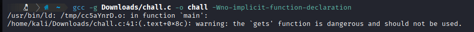
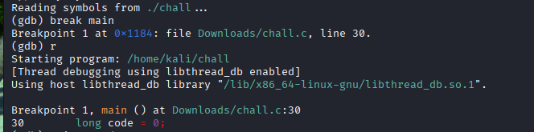
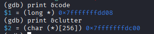
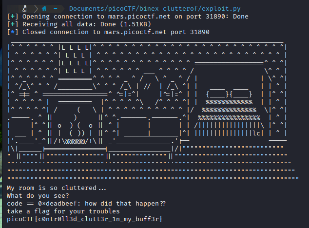

# 1: buffer overflow 0
> Let's start off simple, can you overflow the correct buffer? The program is available [here](assets_binex/vuln). You can view source [here](assets_binex/vuln.c). Connect using: `nc saturn.picoctf.net 55113`
## Solution:
- On reading through the included source code, we see that the flag is only printed when `sigsegv_handler()` is called - when a `SIGSEGV` signal is sent, because of a segmentation fault due to the program trying to access memory locations it is not authorized to.
- In `main()`, `buf1` is given a buffer size of 100, but when the same string is passed through to `vuln()`, it only has a buffer size of 16, thus any input to `buf1` that exceeds 16 chars will overflow the buffer - which `strcpy()` ignores - leading to a segfault, which will invoke `sigsegv_handler()` and give out the flag.


## Flag:
`picoCTF{ov3rfl0ws_ar3nt_that_bad_ef01832d}`
## Notes:
- In this challenge, `gets()` ignores `buf1`'s size limit, but I am not sure why this would matter since `buf2`'s 16 byte limit is below `buf1`'s 100 byte limit.
### Resources:
- https://www.reddit.com/r/C_Programming/comments/yqotjn/what_is_segmentation_fault_in_c_programming/
- https://en.wikipedia.org/wiki/Buffer_overflow
***
# 2: clutter-overflow
> Clutter, clutter everywhere and not a byte to use. `nc mars.picoctf.net 31890`                                                                   Included source: [chall.c](assets_binex/chall.c)
## Solution:
- For the program to print the flag, we need `code` to be equal to `GOAL` (`0xdeadbeef`), however there is no direct way for the user to modify the value of `code`, hence we need to overflow the buffer of the variable we do get to access, i.e. `clutter` which has a size of 256 bytes.
- To determine how many bytes we need to overflow, I built the executable with debugging symbols by including `-g` and disassembled it using `gdb`.



- We set a *breakpoint* at `main()` to observe the variables after they're allocated memory addresses *but* before they're called by the program.
- Now, we run the program with `r`, and since we set the breakpoint
beforehand, `gdb` pauses execution at that point for us to analyze.



- Using the `&` operator, we can access the memory addresses of variables *(PSUC knowledge wow)* and we print out `&code` and `&clutter`.



- Using a online hexadecimal calculator, we deduce that the offset between these two is 264 bytes (256 bytes + 8 bytes).
- Now, we simply construct a payload that overflows `clutter` by sending 264 bytes of junk and then `deadbeef` (in Little Endian since our system runs on x86_64) to overwrite `code` and output the flag.
- I construct the following script using `pwntools` and get the flag on running it.
```
#!/usr/bin/env python3
from pwn import *
conn = remote('mars.picoctf.net', 31890)
payload = b'A' * 264 + p32(0xdeadbeef)
conn.sendline(payload)
print(conn.recvall().decode())
```



## Flag:
`picoCTF{c0ntr0ll3d_clutt3r_1n_my_buff3r}`
## Notes:
- Spent a lot of time debugging my payload, I first tried to directly pipe through a `python` command to the `nc` however `python3` has some quirks with concatenating strings and bytes so that didn't work out, eventually landing on the aforementioned script.
- Could've probably found out the offset between `code` and `clutter` through trial & error, but using `gdb` to find the offset sounded like a more elegant solution.
### Resources:
- https://www.calculator.net/hex-calculator.html
- https://docs.pwntools.com/en/stable/intro.html#making-connections
- https://docs.pwntools.com/en/stable/intro.html#packing-integers
***
# 3: format string 0
>Can you use your knowledge of format strings to make the customers happy? Download the binary [here](assets_binex/format-string-0). Download the source [here](assets_binex/format-string-0.c). Connect with the challenge instance here: `nc mimas.picoctf.net 62314`
## Solution:
- Just like *buffer overflow 0*, this challenge too has a `sigsegv_handler()`, which we exploit by sending a string longer than the buffer for `choice1`, which is set to `32`, which gives us the flag.


## Flag:
`picoCTF{7h3_cu570m3r_15_n3v3r_SEGFAULT_c8362f05}`
## Notes:
- Quite direct using the knowledge we obtained from *buffer overflow 0*.
