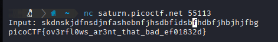
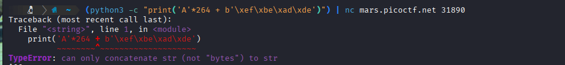
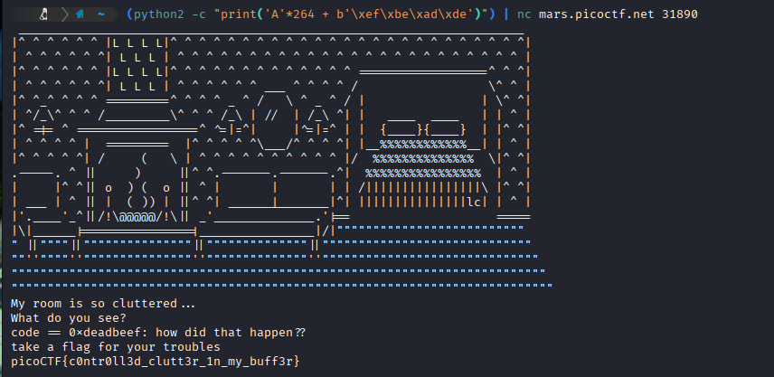
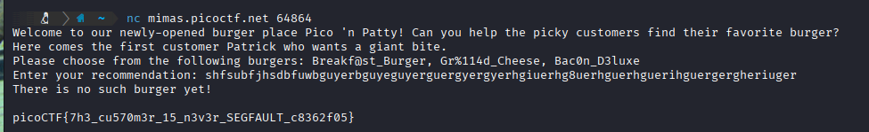

# 1: buffer overflow 0
> Let's start off simple, can you overflow the correct buffer? The program is available [here](assets_binex/vuln). You can view source [here](assets_binex/vuln.c). Connect using: `nc saturn.picoctf.net 55113`
## Solution:
- On reading through the included source code,

## Flag:
`picoCTF{ov3rfl0ws_ar3nt_that_bad_ef01832d}`
## Notes:

***
# 2: clutter-overflow
> Clutter, clutter everywhere and not a byte to use. `nc mars.picoctf.net 31890`
## Solution:
-

## Flag:
`picoCTF{c0ntr0ll3d_clutt3r_1n_my_buff3r}`
***
# 3: format string 0
>Can you use your knowledge of format strings to make the customers happy? Download the binary [here](assets_binex/format-string-0). Download the source [here](assets_binex/format-string-0.c). Connect with the challenge instance here: `nc mimas.picoctf.net 62314`
## Solution:
-

## Flag:
`picoCTF{7h3_cu570m3r_15_n3v3r_SEGFAULT_c8362f05}`
