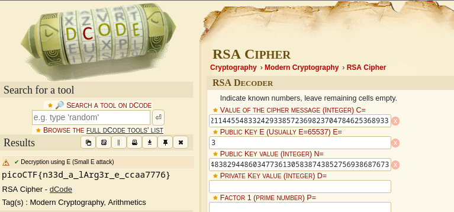
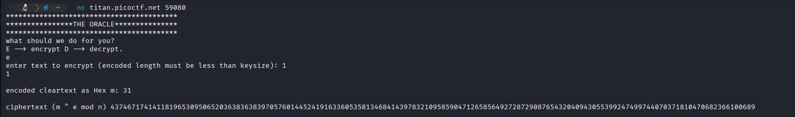
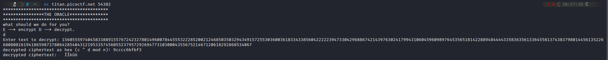
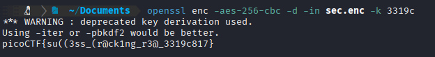

# 1: miniRSA
 > Let's decrypt this: [ciphertext](assets_crypto/ciphertext)? Something seems a bit small.

 ciphertext:
 ```
N:29331922499794985782735976045591164936683059380558950386560160105740343201513369939006307531165922708949619162698623675349030430859547825708994708321803705309459438099340427770580064400911431856656901982789948285309956111848686906152664473350940486507451771223435835260168971210087470894448460745593956840586530527915802541450092946574694809584880896601317519794442862977471129319781313161842056501715040555964011899589002863730868679527184420789010551475067862907739054966183120621407246398518098981106431219207697870293412176440482900183550467375190239898455201170831410460483829448603477361305838743852756938687673
e: 3

ciphertext (c): 2205316413931134031074603746928247799030155221252519872650073010782049179856976080512716237308882294226369300412719995904064931819531456392957957122459640736424089744772221933500860936331459280832211445548332429338572369823704784625368933
```

 ## Solution:
 - We are given `N`, `e` and `c`, which we simply input to an online RSA decoder and obtain the flag.

 

 ## Flag:
 `picoCTF{n33d_a_lArg3r_e_ccaa7776}`
 ***
 # 2: Custom Encryption
 > Can you get sense of this code file and write the function that will decode the given encrypted file content. Find the encrypted file here [flag_info](https://artifacts.picoctf.net/c_titan/92/enc_flag) and [code file](https://artifacts.picoctf.net/c_titan/92/custom_encryption.py) might be good to analyze and get the flag.
 ## Solution:
 - Reading through the included encryption script, I observed that it:
    1) Creates a shared key using `p` and `g`:
    2) Reverses the plaintext to be encrypted, then performs XOR on it with the key `trudeau`
    3) Takes each character of the output from the previous step and performs `ord(char) * shared_key * 311` on it.
- Since the encrypted flag provides us with `a` and `b`, we can easily reverse this encryption by:
    1) Generating the shared shared_key
    2) Reversing the multiplication operation by `// (shared_key*311)`
    3) XOR'ing again with `trudeau`, since the inverse of a XOR operation is XOR itself.
- I created a script to perform these tasks and obtained the flag.
```
def generator(g, x, p):
    return pow(g, x) % p

def decrypt_stage2(cipher, key):
    semi_cipher = ""
    for num in cipher:
        original_ord = num // (key * 311)
        semi_cipher += chr(original_ord)
    return semi_cipher

def dynamic_xor_decrypt(cipher_text, text_key):
    plaintext = ""
    key_length = len(text_key)
    for i, char in enumerate(cipher_text):
        key_char = text_key[i % key_length]
        decrypted_char = chr(ord(char) ^ ord(key_char))
        plaintext += decrypted_char
    return plaintext[::-1]

a = 89
b = 27
cipher = [33588, 276168, 261240, 302292, 343344, 328416, 242580, 85836, 82104, 156744, 0, 309756, 78372, 18660, 253776, 0, 82104, 320952, 3732, 231384, 89568, 100764, 22392, 22392, 63444, 22392, 97032, 190332, 119424, 182868, 97032, 26124, 44784, 63444]

p = 97
g = 31

# Recreate shared key
u = generator(g, a, p)
v = generator(g, b, p)
shared_key = generator(v, a, p)

semi_cipher = decrypt_stage2(cipher, shared_key)
flag = dynamic_xor_decrypt(semi_cipher, "trudeau")

print(flag)
```
## Flag:
`picoCTF{custom_d2cr0pt6d_dc499538}`
***
# 3: RSA Oracle
> Can you abuse the oracle? An attacker was able to intercept communications between a bank and a fintech company. They managed to get the [message](https://artifacts.picoctf.net/c_titan/149/secret.enc) (ciphertext) and the [password](https://artifacts.picoctf.net/c_titan/149/password.enc) that was used to encrypt the message. After some intensive reconassainance they found out that the bank has an oracle that was used to encrypt the password and can be found here `nc titan.picoctf.net 59080`. Decrypt the password and use it to decrypt the message. The oracle can decrypt anything except the password.
## Solution:
- As mentioned in the hints, we know that we must use a "Known Plaintext Attack" and that we must take advantage of the RSA algorithm by sending a custom crafted message to the oracle.
- the RSA algorithm is: `C = m^e mod n`, where e is the public exponent - which is most commonly 65537 and n is the modulus - which is typically a 2048 bit prime number.
- On establishing the `nc` to the oracle, we are greeted with a menu where the user can either send a character to be encrypted or decrypted. Here, we will send 1, which the program converts to its hex value `31`, and then encrypts to give:
```
4374671741411819653095065203638363839705760144524191633605358134684143978321095859047126585649272872908765432040943055399247499744070371810470682366100689
```



- Now, using the *homomorphic* property of RSA encryption, which basically means that `RSA(a) x RSA (b) = RSA(a*b)`, we can multiply the obtained ciphertext from encrypting `1`, multiply it with our `password.enc`, and have the oracle decrypt it for us!



- Now, we simply divide this by the hex value for `1`, (`0x31`), and obtain the password by converting it to ASCII, which we get as `3319c`.

- Finally, using the OpenSSL hint, we decrypt `secret.enc` and obtain the flag.



## Flag:
`picoCTF{su((3ss_(r@ck1ng_r3@_3319c817}`
