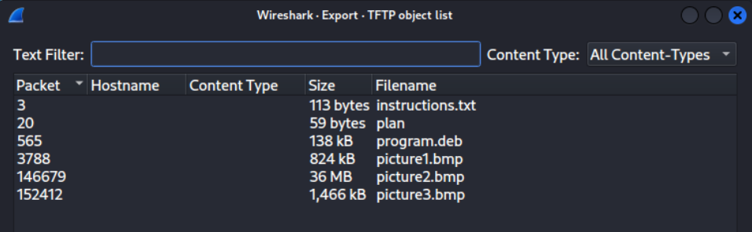

# 1. trivial flag transfer protocol
> Figure out how they moved the [flag](tftp.pcapng).

## Solution:
- The included file is a `pcapng` file, which can be opened in Wireshark.

- From the challenge's name we can infer that the *TFTP* protocol would be useful and we export all objects transferred through it by going to `File > Export Objects > TFTP...`

- Going through the files we obtain from the export, we find two ROT-13 encoded messages in [instructions.txt](assets_forensics/instructions.txt) and [plan](assets_forensics/plan), which decode to give `TFTPDOESNTENCRYPTOURTRAFFICSOWEMUSTDISGUISEOURFLAGTRANSFERFIGUREOUTAWAYTOHIDETHEFLAGANDIWILLCHECKBACKFORTHEPLAN` and `IUSEDTHEPROGRAMANDHIDITWITH-DUEDILIGENCE.CHECKOUTTHEPHOTOS` respectively.

- Looking inside [program.deb](assets_forensics/program.deb), we see that it is the `steghide` package, so I install it on my system and try to extract the files using the passphrase `DUEDILIGENCE` as previously learnt.
- Going through the pictures one by one, on invoking `steghide` on `picture3.bmp` we get the flag.
  
  
## Flag
`picoCTF{h1dd3n_1n_pLa1n_51GHT_18375919}`

## Notes:
- Not many new learnings or incorrect tangents, straightforward challenge that was easily doable with my prior knowledge
***

# 2. m00nwalk
> Decode this [message](assets_forensics/message.wav)
from the moon.
## Solution:
- Using the hint provided in the challenge, we learn that the protocol employed here is one used in the Apollo 11 mission.
  

- Searching it online, we find that pictures from the moon landing were transmitted over *SSTV* (Slow-Scan Television), for which multiple encoders exist online, using which we decode the audio file to obtain this image:

## Flag:
`picoCTF{beep_boop_im_in_space}`

## Notes:
### Incorrect tangents:
- Spent a lot of time trying to recognize the audio file without the use of the included hint
## Resources:
- https://sstv-decoder.mathieurenaud.fr/ka