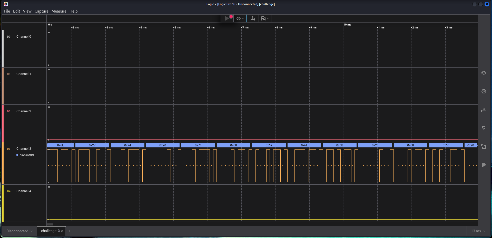
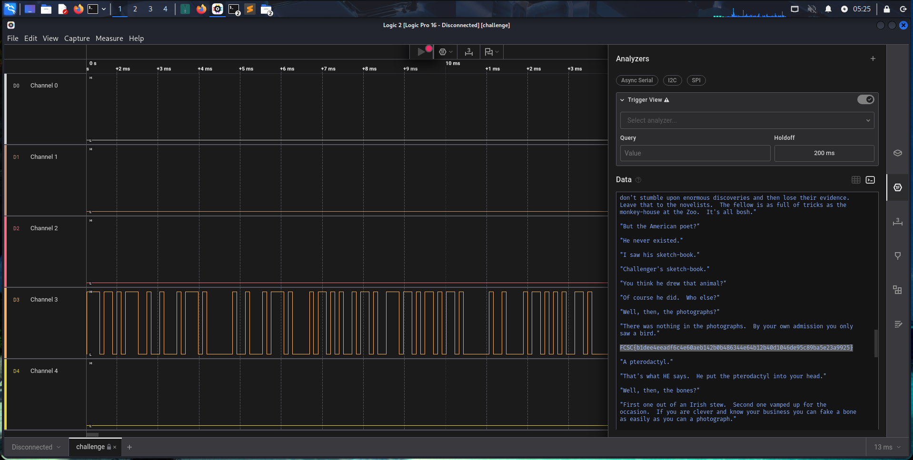
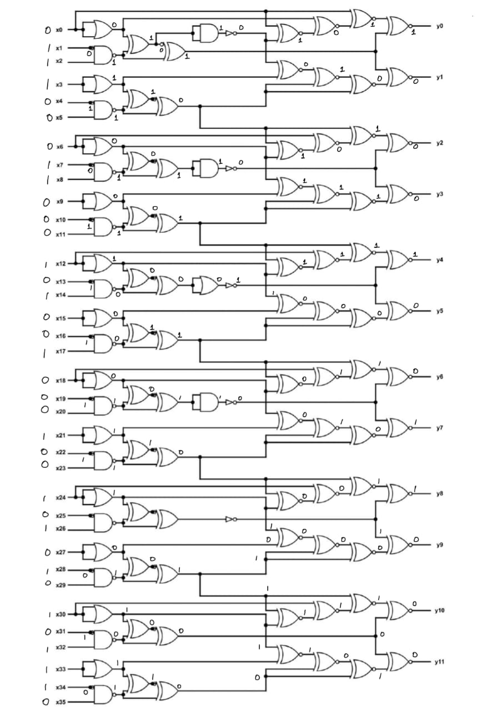
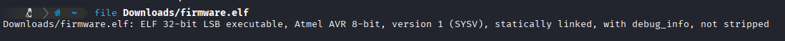
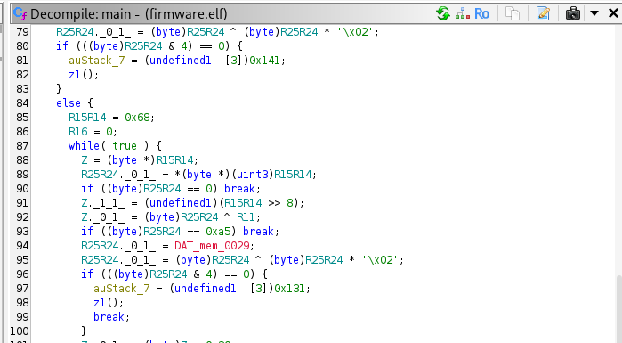

# 1: I like Logic
> i like logic and i like files, apparently, they have something in common, what should my next step be.
Included file: [challenge.sal](assets_hardware/challenge.sal)
## Solution:
- Looking up `.sal` tells us that it's a capture file from the *Salae Logic Analyser*, which I download the AppImage for and start up.
- Opening the included file in the software, we get something that looks like this:



- Just clicking around the interface, I stumble upon the `Analyzers` tab, whereupon clicking the `Terminal` output button, we find a huge block of text, with the flag in the middle.



## Flag:
`FCSC{b1dee4eeadf6c4e60aeb142b0b486344e64b12b40d1046de95c89ba5e23a9925}`
## Notes:
- Expected the challenge to be way more involved but I got lucky with this one.
### Resources:
- https://exploit-notes.hdks.org/exploit/hardware/sal-logic-analysis/ (only to find out what a `.sal` file even is)

# 2: IQ Test
> let your input x = 30478191278. wrap your answer with nite{ } for the flag. As an example, entering x = 34359738368 gives (y0, ..., y11), so the flag would be nite{010000000011}. Included photo: [iqtest](assets_hardware/iqtest.png)
## Solution:
- Looking at the daunting network of logic gates, we observe that it has 36 inputs from x0 to x35, hence we need 36 binary digits corresponding to each input, from which point we can solve the challenge.
- We convert the given input (30478191278) to binary, which gives us:
```
11100011000101001000100101010101110
```
- However, this is only 35 digits, so we prefix the number with a `0`, keeping its value intact and still obtaining the required 36 digits.
- Next, I solved the logic gates by hand, and got the flag.



## Flag:
`nite{100010011000}`
## Notes:
- Tried to recreate the circuit in an online simulator but decided against it since it would take up too much time and solving it by hand wasn't really that hard.
- Realized quite late into the manual solving process that a lot of the branches could be skipped.
### Resources:
- A cheatsheet I found online:

***
# 3: Bare Metal Alchemist
>
## Solution:


