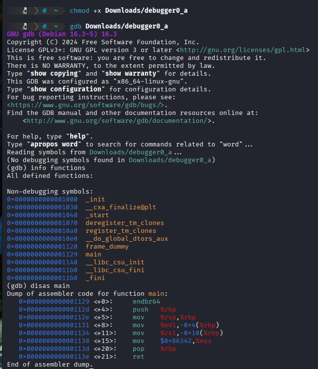
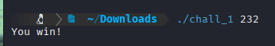

# 1: GDB baby step 1
> Can you figure out what is in the eax register at the end of the main function? Put your answer in the picoCTF flag format: picoCTF{n} where n is the contents of the eax register in the decimal number base. If the answer was 0x11 your flag would be picoCTF{17}. Disassemble [this](assets_reveng/debugger0_a).
## Solution:



- We are told to look in the `eax` register at the end of the `main` function, and the challenge's name also points towards using `gdb`, so we give the user executable permissions for the file using `chmod +x` and open it in `gdb`.
- Next, we get a dump of all the functions present in the executable using `info functions` and disassemble the `main` function with `disas main`.
- Looking in the disassembly, we can see that `0x86342` was moved into the `eax` register near the end of `main`, which we convert to decimal and get the flag.

## Flag:
`picoCTF{549698}`

## Notes:
- Pretty straightforward challenge, only hitch came while learning `gdb` syntax.
### Resources:
- https://gist.github.com/jarun/ea47cc31f1b482d5586138472139d090
***
# 2: Vault Door 3
> This vault uses for-loops and byte arrays. The source code for this vault is here: [VaultDoor3.java](assets_reveng/VaultDoor3.java)
## Solution:
- Looking at the source code provided, we observe that the `checkPassword` function takes an input string from the user, applies certain transformations, and checks whether the modified string matches `jU5t_a_sna_3lpm18g947_u_4_m9r54f`.
- We can easily reverse this by applying the reverse of the transformations to the final string and getting the correct input using a [script](assets_reveng/rev-script.c) for which I used C.
- Running the script with the string as the input, we get `jU5t_a_s1mpl3_an4gr4m_4_u_79958f` as the output, and hence the flag.
## Flag:
`picoCTF{jU5t_a_s1mpl3_an4gr4m_4_u_79958f}`
## Notes:
- Fairly simple challenge, no hiccups anywhere, easily comprehended the .java file provided and replicated it in C for ease of manipulation.
***
# 3: ARMssembly 1
> For what argument does this program print `win` with variables 87, 3 and 3? File: [chall_1.S](assets_reveng/chall_1.S) Flag format: picoCTF{XXXXXXXX} -> (hex, lowercase, no 0x, and 32 bits. ex. 5614267 would be picoCTF{0055aabb})
## Solution:
- Instead of trying to comprehend the assembly file given, I converted it to [Python](assets_reveng/converted.py) using an online converter.
```
import sys

def func(x):
    a = xhttps://www.codeconvert.ai/assembly-to-python-converter?id=9086e5e4-63c2-4bf5-abf9-07c17a5e4890
    b = 87
    c = 3
    d = 3
    e = b << c
    e = e // d
    e = e - a
    return e

def main():
    # Simulate argv and argc from sys.argv
    argc = len(sys.argv)
    argv = sys.argv

    if argc > 1:
        val = int(argv[1])
    else:
        val = 0

    result = func(val)
    if result == 0:
        print("You win!")
    else:
        print("You Lose :(")

if __name__ == "__main__":
    main()
```

### What does this program do?
- The program takes an argument on the command line (defaults to 0 if not provided, courtesy of the `if argc > 1` statement) and passses it to `func()`.
- In `func()`, `x` is the argument given by the user which is used for a series of calculations:
  1) `b`, `c`, and `d` are set to be 87, 3 and 3 respectively
  2) A leftwise shift by `c` bits (3) is performed on `b` (87), which is the same as 87 * 2^3 = 696 = `e`
  3) Next, `e` is dividied by `d` (3) = 696/3 = 232
  4) `e` is set to `e - a` (`a` is the command line input) and it is returned to `main()`
- Therefore, when `e = 0`, the `win` condition is called and so we can say that for `x = 232` it will be true, and we confirm this by running the executable with `./chall_1 232`



- The challenge description mentions that the flag format is hexadecimal, so we convert 232 to hex, getting `0xE8`, and padding it with leading zeroes, we get the flag.

## Flag:
`picoCTF{000000E8}`

## Notes:
- Spent a lot of time trying to decipher the original assembly file, which was honestly a waste of time, figuring out the conversion made the process much easier.
- Compiled the program on x86 using GNU's cross compiler (`binutils-aarch64-linux-gnu`) and ran it as a regular command line program using `QEMU-user-static`
### Resources:
- https://github.com/joebobmiles/ARMv8ViaLinuxCommandline
- https://azeria-labs.com/arm-on-x86-qemu-user/
- https://www.codeconvert.ai/assembly-to-python-converter?id=9086e5e4-63c2-4bf5-abf9-07c17a5e4890
