# 1. Cookies
> Who doesn't love cookies? Try to figure out the best one. [http://mercury.picoctf.net:29649/](http://mercury.picoctf.net:29649/)
## Solution:
- On opening the aforementioned website, we find a search bar and `snickerdoodle` as a placeholder in the field. Because of the challenge's name, I am drawn towards the website's cookies and look for changes when I input `snickerdoodle` into the search bar.

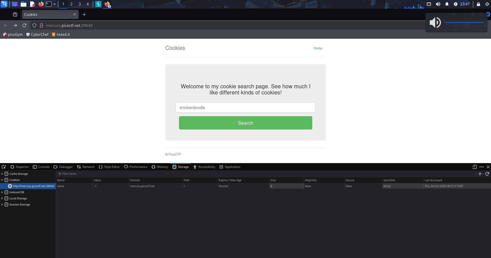

- As expected, the `value` field in the `name` cookie changes when we enter the search term, so we can assume that other "cookies" will have different values for the `name` cookie.

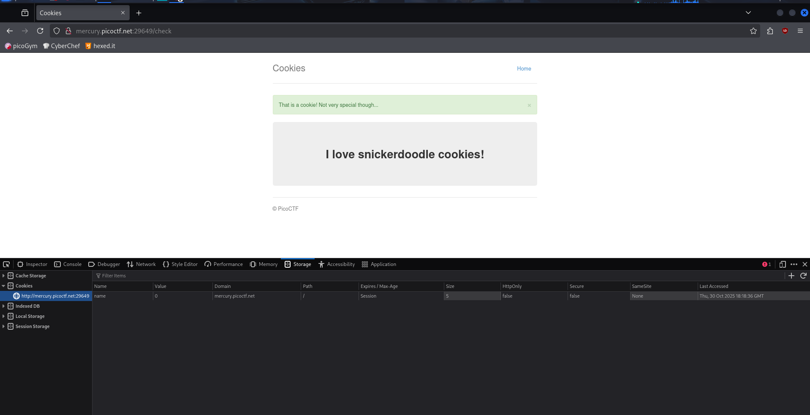

- Trying another famous cookie (the gingerbread), we see the `value` field change again, so we can confirm that this is the intended solution to solve this challenge.

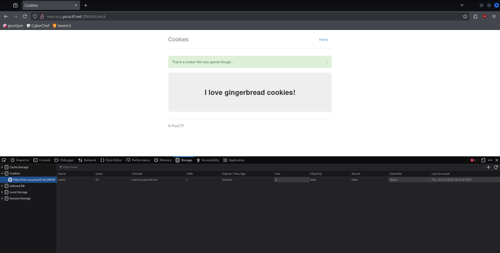

- Opening BurpSuite, we open the website in the included browser, go to the dashboard, and send the website to the Intruder.

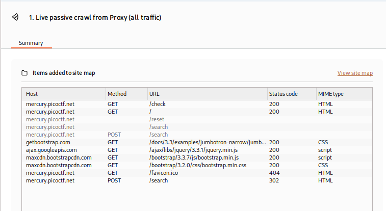

- In the intruder, we see the following, and at the highlighted position, we insert `Add §` in place of `name=-1` to insert payloads.

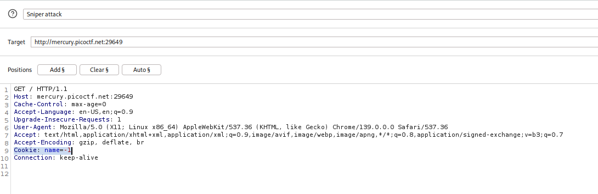

- From what we inferred from our prior analysis, we set the payload to iterate from `-25` to `25` to go through all the possible cookie values.

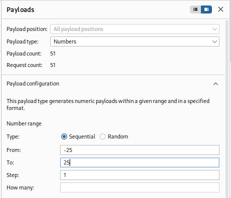

- Going through the results, we sort them by length of response and find an anomaly at `Payload = 18` and get the flag.

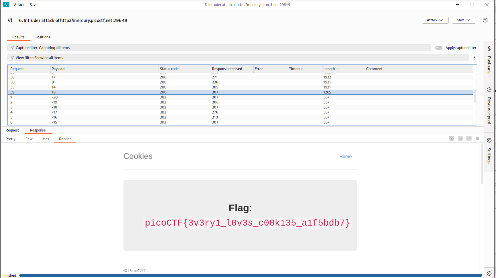

## Flag:
`picoCTF{3v3ry1_l0v3s_c00k135_a1f5bdb7}`

## Notes:
- Using BurpSuite to solve this challenge is just one of many ways, we could just as easily `import requests` and create a Python script.
### Resources:
- https://portswigger.net/burp/documentation/desktop/tools/intruder/getting-started

***

# 2: SSTI1
> I made a cool website where you can announce whatever you want! Try it out! I heard templating is a cool and modular way to build web apps! Check out my website [here](http://rescued-float.picoctf.net:59013/)!
## Solution:
- The challenge's name gives us a hint as to what it's about, i.e. Server Side Template Injection (abbreviated as SSTI).
- A template engine (as in Server Side *Template* Injection) uses prexisting static templates and with the data inputted by the user at runtime, generates dynamic output (like a name field and such).
- A SSTI occurs when a website passes through user input to the template engine directly as template code without cleaning it up, thus *injecting* it.

- To find out which template is being used here, we use this handy flowchart. ([source](https://portswigger.net/research/server-side-template-injection#Identify))
- Steps:
  1) Input `${7*7}` in the input field , which returns the same string.
  2) Following the flowchart, we input `{{7*7}}` which returns 49.
  3) Next, `{{7*'7'}}` which gives `7777777`, thus confirming that it's `Jinja2`.

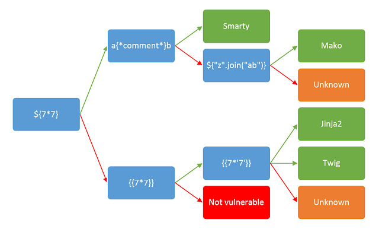

- Now that we know it's `Jinja2`, I looked for common exploits on the template engine and found [this website](https://dojo-yeswehack.com/learn/vulnerabilities/jinja2) where I found this payload to execute Linux commands on `Jinja2`:
```
{{ self.__init__.__globals__.__builtins__.__import__('os').popen('insert_command').read() }}
```

- With this, I invoke `ls` and get:

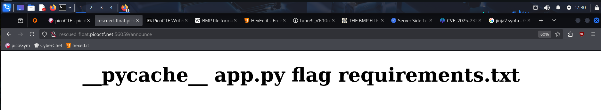

- Now, we simply do `cat flag`.


## Notes:
- Spent a lot of time learning about Jinja2 and SSTI in general, why the vulnerability exists and how it can be exploited.
- Went on a wild goose chase with the payloads for a while
### Resources:
- https://portswigger.net/research/server-side-template-injection#Identify
- https://dojo-yeswehack.com/learn/vulnerabilities/jinja2
- https://santhosh-adiga-u.medium.com/exploiting-server-side-template-injection-ssti-in-jinja2-from-input-field-to-remote-code-403547b9b90c
- https://www.offsec.com/blog/cve-2025-23211/
***
# 3: Web Gauntlet
> Can you beat the filters? Log in as admin http://shape-facility.picoctf.net:59342/ http://shape-facility.picoctf.net:59342/filter.php
## Solution:
- We are told to log in as admin to the given website which has only a username and password field, and opening `filter.php` we see:
```
Round1: or
```
- This led me to believe that the challenge wants us to perform SQL injection, but the most common payload, i.e. `'OR '1' = 1'1;` is blocked by the filter, so we have to get creative.
- First, I input a random test login combo.

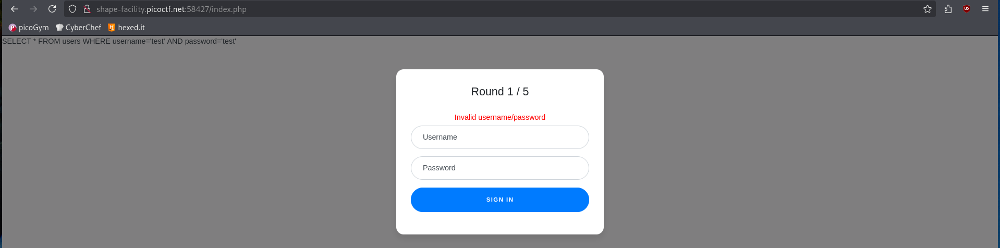

- Here, we can see what the sign in page actually runs in the background:
```
SELECT * FROM users WHERE username='{input}' AND password='{input}'
```
- So, with our payload, we have to bypass the password check since we have no way of knowing what it is, and I input `admin';--` and get through `Round 1`.
- For `Round 2`, `filter.php` reads:
```
Round2: or and like = --
```
- The comment operator `--` is now blocked by the filter, however we can also use `/*` like in C to comment out the password check, and I craft the payload `admin';/*` which gets me to `Round 3`.
- The filter for `Round 3` doesn't impact our payload so I run it again and get to `Round 4`, where we see:
```
Round4: or and = like > < -- admin
```
- From this round, we cannot directly input `admin` to the username field, and I think of bypassing this using some form of concatenation, which in SQL is the `||` operator, using which I craft the payload: `ad'||'min';/*`
- Again, `Round 5`'s filter doen't hinder our current payload so we run it again:

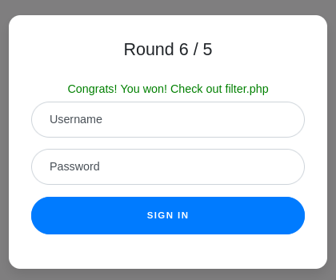

- Going to `filter.php`, we see the source for the challenge and find the flag commented out at the end.

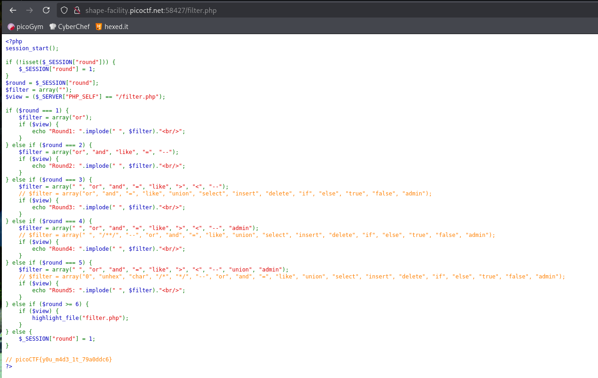

## Flag:
`picoCTF{y0u_m4d3_1t_79a0ddc6}`

## Notes:
- Tried the standard `'OR '1' = '1';--` multiple times before reading `filter.php`
- Spent a lot of time trying to figure out the syntax for SQLi properly
### Resources:
- https://portswigger.net/web-security/sql-injection/lab-login-bypass
- https://www.w3schools.com/sql/sql_comments.asp
- https://www.geeksforgeeks.org/sql/sql-concatenation-operator/
